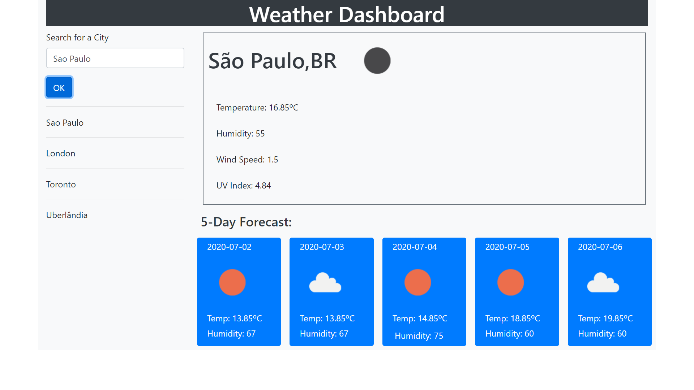

# homework06
Weather Dashboard
Check weather condition of (almost) any city on the planet before you leave home.
By typing the city name, you get current weather conditions and a 5 day forecast.
Ajax was used to get information from Open Weather API.
A list of the last 10 cities previously searched will be kept on the left side of the screen, 
so you don't even have to retype it next time you need.

